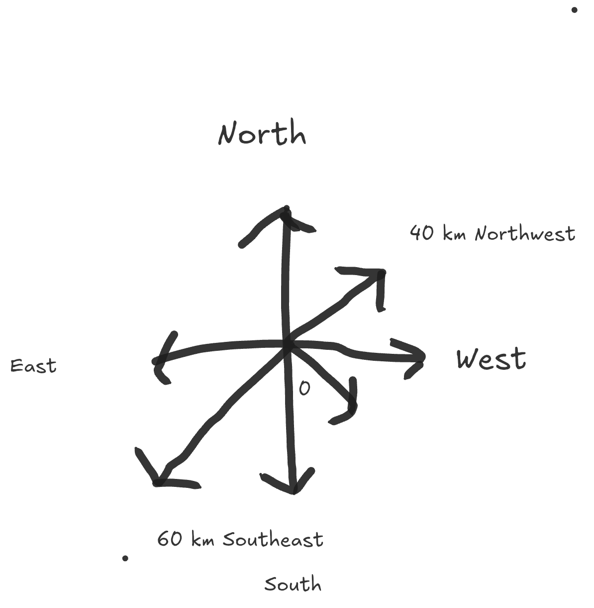
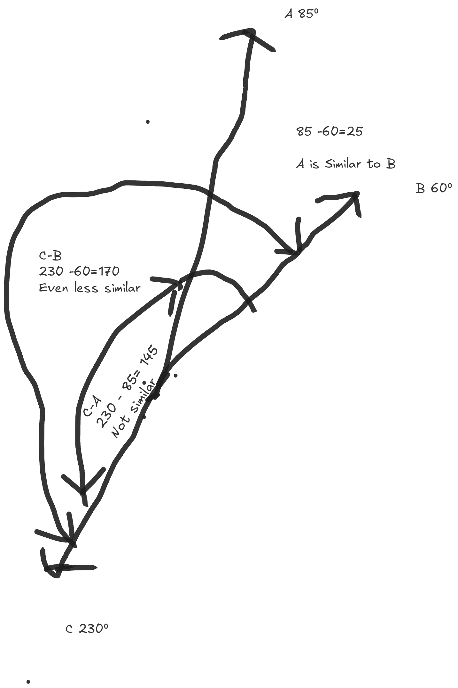

# Chapter 1

## Where Traditional Queries Fail
Picture this: your dog just birthed a cute litter of say 5 puppies

Now lets assume you have no other pets.

If I asked you:"how many pets do you have?", you would naturally say 6.
If I asked you:"how many dogs do you have?", you would of course naturally say 6.

Now I asked slightly similar questions, but your brain was able to understand; get the gist (pun fully intended) and answer correctly;

If you were querying a database for the same answer you would write something to this effect:

```sql
SELECT * FROM animals WHERE type = 'pet';
```
or

```sql
SELECT * FROM pets WHERE type = 'dog';
```

Depending on how you design your database and queries you might get actually decent results for such searches;

But we're already running into some interesting problems;
Chief of them is that we need to design our tables and queries to accurately represent relationships between data; not a small feat in itself.
for that we need structured data.


Bear in mind that most everyday data is unstructured:

- "I have 2 Rottweilers"
- "I have 3 Cats"
- "I have 3 Tom cats"
- "I have a pet parrot"
- "I have a pet bird"

It will be obvious to our brains that those sentences above have high "similarity"
But to a database, it's not so unless we explicitly design it to be so.

That leads us to the most important issue; encoding such "similarities" in a way that machines can understand and process;

## Vector Search

Vectors come across as a handy way to mathematically represent such info.

In its simplest form; a vector is any quantity that has both magnitude and direction;
Lets say you have a map



Imagine you're standing at the origin (the center point marked "0").

I could tell you to move **60 km**, but that's incomplete—60km *where*?

You need both pieces of information:
- **Magnitude:** 60 km (how far)
- **Direction:** Northwest (which way)

So the complete instruction is: "Move 60km Northwest" or "Move 40km Southeast" or "Move 40km North."

### Why Direction Matters
Disclaimer: i suck at compass navigation
Now imagine three people starting at the origin:
- **Person A:** Moves 90km Northwest
- **Person B:** Moves 60km Northwest  
- **Person C:** Moves 10km Southeast

Even though Person C traveled the least (10km), they're actually the **farthest** from Person A.

Person B, who only went 60km, is **closer** to Person A than Person C is.

Why? Because Person B's direction (Northwest) is more similar to Person A's direction (Northwest) than Person C's direction (Southeast).


### Measuring Similarity with Angles
But the previous direction itself was in fact incomplete.

Northwest could be any direction between North and West; to be more precise we add angles:

- move 90km 85° Northwest
- move 60km 60° Northwest
- move 10km 230° Southeast


- 
How do we measure how "similar" two directions are?
We measure the **angle** between them.



The smaller the angle, the more similar.

So if we represent "dog" as 40° Northwest, "puppy" as 60° Northwest, and "car" as 230° Southeast, it's obviously easy to see which are similar.

## Back to Queries
Back to our cute puppy litters.

If we could represent each sentence as a vector:
- "How many pets do you have?" → Vector A (pointing in some direction)
- "How many dogs do you have?" → Vector B (pointing in a similar direction)
- "What's the weather today?" → Vector C (pointing in a completely different direction)

Then finding similar questions becomes a simple matter of:
- Converting and labeling our data as vectors
- Converting the query into a vector
- Measuring the angle between the query and all stored vectors
- Returning the ones with the smallest angles

While we've covered the basics of how this works, we still have a lot to explore.


