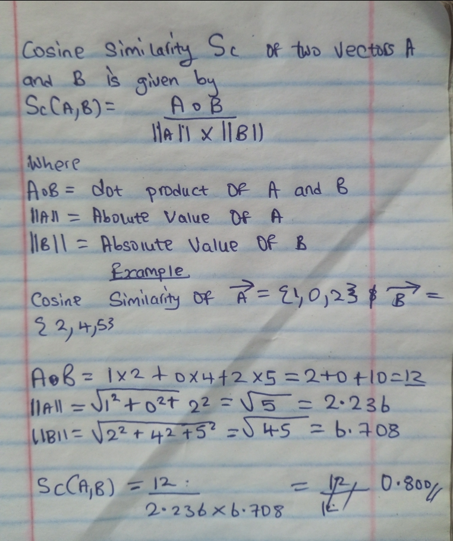

# Chapter 2

In this chapter, we will implement a basic vector search over an FAQ file.  
If you're not already familiar with the concept of vector search or need a refresher, I encourage you to check out the previous chapter.

Let's get started.

---

## Setting Up the Project

Create a new cargo project and add these to your dependencies:

```toml
{{#include ../embeddings/Cargo.toml:9:15}}
```

Create a `types.rs` file in your `src` folder and add the following imports:

```rust 
{{#include ../embeddings/src/types.rs:1:7}}
```

---

## The Embedding Type

We need a type-safe way to represent embeddings in Rust.

```rust
{{#include ../embeddings/src/types.rs:9:13}}
```

---

## Generating Vectors with Embedding Models

To get our vectors, we use special models known as embedding models.  
These models are trained specifically to represent text in vector format, so you can reliably reproduce the same vector for the same text.

The model we're using is **gemini-embedding-001**.  
This model uses 768-dimensional coordinates to encode data.

First, grab your API key from [Google AI Studio](https://aistudio.google.com/app/apikey).

Set your Gemini API key as an environment variable:

```bash
export GEMINI_API_KEY="your_api_key_here"
```

### Example: REST API Call

Here's an example request to the Gemini embedding model:

```bash
curl "https://generativelanguage.googleapis.com/v1beta/models/gemini-embedding-001:embedContent" \
    -H "Content-Type: application/json" \
    -H "x-goog-api-key: ${GEMINI_API_KEY}" \
    -d '{
        "model": "models/gemini-embedding-001",
        "content": {
            "parts": [{
                "text": "What is the meaning of life?"
            }]
        }
    }'
```

>[!IMPORTANT]
>Whenever you use a model to embed data, ensure the same model is used to embed search queries.

Obviously we're not going to be working with curl.  
We need (I know, I know) a type-safe way of making HTTP requests—so we're using reqwest.

```rust
{{#include ../embeddings/src/types.rs:15:29}}
```

Now we can make calls to the API via reqwest:

```rust
impl Embedding {
{{#include ../embeddings/src/types.rs:104:143}}
}
```

---

We now have an easy way to vectorize any given piece of text.

Let's add a way to create embeddings:

```rust
{{#include ../embeddings/src/types.rs:184:192}}
```

Next we need a database to store our embeddings:

```rust
{{#include ../embeddings/src/types.rs:53:80}}
```

We use bytemuck to cast our vectors to binary since SQLite does not support floating-point storage out of the box.

We've set up the bulk of this. We're only left with a way of comparing vectors.

---

## The Cosine Similarity

In Chapter 1, we defined the similarity between two vectors as a measure of the angular difference between them as observed from the origin.

In practice, we use what is known as Cosine Similarity. Unlike angles which tell us where a vector is pointing relative to the x, y, or z axes—Cosine Similarity tells us how Vector A is oriented relative to Vector B.

Cosine Similarity measures the angle between any two non-zero vectors.
It ranges from:
- **-1** meaning opposite vectors (pointing in opposite directions)
- **0** meaning zero similarity (perpendicular vectors)
- **1** meaning identical vectors (pointing in the same direction)

The formula is described below:



The above cosine similarity of 0.8 represents a high match.

We need to implement the cosine similarity for any two arbitrary non-zero vectors with n dimensions:

```rust
{{#include ../embeddings/src/types.rs:35:53}}
```

---

## Searching with Vector Similarity

Now we can use this. We grab all embeddings in our database, compare each vector, and return the top highest matches.

Simple enough, right?

```rust
{{#include ../embeddings/src/types.rs:81:99}}
```

---

We've gotten all the working parts ready!

Now to use it—see you in the next chapter!

>[!NOTE]
>I've taken the liberty to add some helper functions to enable more speedy processing. Don't be surprised when you see them.
