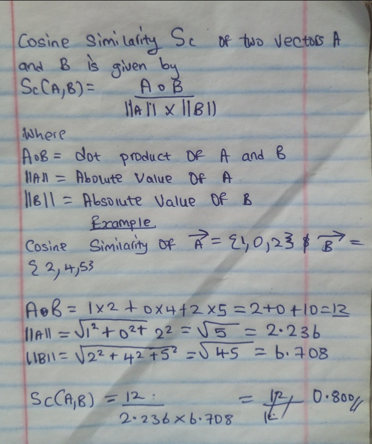
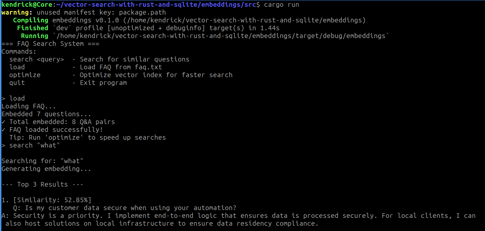
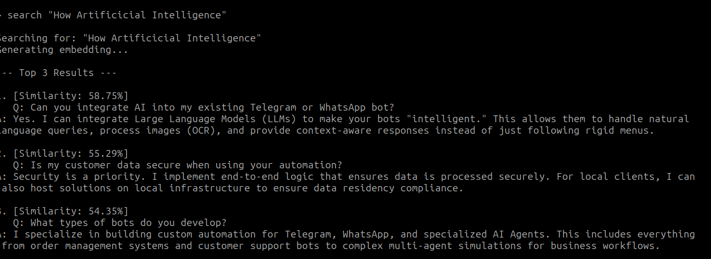

# Chapter 2

In this chapter, we will implement a basic vector search over an FAQ file.  
If you're not already familiar with the concept of vector search or need a refresher, I encourage you to check out the previous chapter.

Let's get started.

---

## Setting Up the Project

Create a new cargo project and add these to your dependencies:
```toml
reqwest = { version = "0.13.1", features=["json","native-tls"]}
rusqlite = "0.38.0"
serde = { version = "1.0.228", features = ["derive"] }
serde_json = "1.0.149"
tokio = { version = "1.49.0",features=["macros","rt-multi-thread"]}
```

Create a `types.rs` file in your `src` folder and add the following imports:
```rust
// src/types.rs

use reqwest;
use rusqlite::{Connection, Result as SqlResult, params};
use serde::Deserialize;
use serde_json::json;
use std::env;
```

---

## The Embedding Type

We need a type-safe way to represent embeddings in Rust.
```rust
#[derive(Debug)]
pub struct Embedding {
    pub label: String,
    pub vector: Vec<f32>,
}
```

---

## Generating Vectors with Embedding Models

To get our vectors, we use special models known as embedding models.  
These models are trained specifically to represent text in vector format, so you can reliably reproduce the same vector for the same text.

The model we're using is **gemini-embedding-001**.  
This model uses 768-dimensional coordinates to encode data.

First, grab your API key from [Google AI Studio](https://aistudio.google.com/app/apikey).

Set your Gemini API key as an environment variable:
```bash
export GEMINI_API_KEY="your_api_key_here"
```

### Example: REST API Call

Here's an example request to the Gemini embedding model:
```bash
curl "https://generativelanguage.googleapis.com/v1beta/models/gemini-embedding-001:embedContent" \
    -H "Content-Type: application/json" \
    -H "x-goog-api-key: ${GEMINI_API_KEY}" \
    -d '{
        "model": "models/gemini-embedding-001",
        "content": {
            "parts": [{
                "text": "What is the meaning of life?"
            }]
        }
    }'
```

>[!IMPORTANT]
>Whenever you use a model to embed data, ensure the same model is used to embed search queries.

Obviously we're not going to be working with curl.  
We need (I know, I know) a type-safe way of making HTTP requests—so we're using reqwest.
```rust
#[derive(Deserialize)]
struct GeminiResponse {
    embedding: EmbeddingValues,
}

#[derive(Deserialize)]
struct BatchGeminiResponse {
    embeddings: Vec<EmbeddingValues>,
}

#[derive(Deserialize)]
struct EmbeddingValues {
    values: Vec<f64>,
}
```

Now we can make calls to the API via reqwest:
```rust
impl Embedding {
    /// Create a reusable HTTP client.
    pub fn create_client() -> Result<reqwest::Client, reqwest::Error> {
        reqwest::Client::builder().build()
    }

    /// Convert a single piece of text into a vector using Gemini.
    pub async fn vectorize(
        text: &str,
        client: &reqwest::Client,
    ) -> Result<Vec<f32>, Box<dyn std::error::Error>> {
        let key = env::var("GEMINI_API_KEY")?;

        let body = json!({
            "model": "models/gemini-embedding-001",
            "content": {
                "parts": [{ "text": text }]
            }
        });

        let url = "https://generativelanguage.googleapis.com/v1beta/models/gemini-embedding-001:embedContent";

        let res = client
            .post(url)
            .header("x-goog-api-key", &key)
            .json(&body)
            .send()
            .await?
            .json::<GeminiResponse>()
            .await?;

        Ok(res.embedding.values.into_iter().map(|v| v as f32).collect())
    }
}
```

---

We now have an easy way to vectorize any given piece of text.

Let's add a way to create embeddings:
```rust
    /// Construct a single embedding from text.
    pub async fn new(
        label: String,
        client: &reqwest::Client,
    ) -> Result<Self, Box<dyn std::error::Error>> {
        let vector = Self::vectorize(&label, client).await?;
        Ok(Self { label, vector })
    }
```

Next we need a database to store our embeddings:
```rust
    /// Initialize the database schema.
    pub fn init_db(conn: &Connection) -> SqlResult<()> {
        conn.execute(
            "CREATE TABLE IF NOT EXISTS embeddings (
                id INTEGER PRIMARY KEY,
                label TEXT NOT NULL UNIQUE,
                vector BLOB NOT NULL
            )",
            [],
        )?;
        Ok(())
    }

    /// Persist this embedding to SQLite.
    /// Uses bytemuck to safely convert the f32 vector slice into bytes for storage,
    /// since SQLite doesn't natively support floating-point arrays.
    pub fn commit(&self, conn: &Connection) -> SqlResult<()> {
        // bytemuck::cast_slice converts &[f32] to &[u8] for binary storage
        let bytes: &[u8] = bytemuck::cast_slice(&self.vector);

        conn.execute(
            "INSERT OR REPLACE INTO embeddings (label, vector) VALUES (?1, ?2)",
            params![&self.label, bytes],
        )?;
        Ok(())
    }
```

We use bytemuck to cast our vectors to binary since SQLite does not support floating-point storage out of the box.

We've set up the bulk of this. We're only left with a way of comparing vectors.

---

## The Cosine Similarity And Cosine Distance

In Chapter 1, we defined the similarity between two vectors as a measure of 
the angular difference between them as observed from the origin.

In practice, we use what is known as Cosine Similarity. Unlike angles which 
tell us where a vector is pointing relative to the x, y, or z axes — Cosine 
Similarity tells us how Vector A is oriented relative to Vector B.

Cosine Similarity measures the angle between any two non-zero vectors.
It ranges from:
- **-1** meaning opposite vectors (pointing in opposite directions)
- **0** meaning zero similarity (perpendicular vectors)
- **1** meaning identical vectors (pointing in the same direction)

The formula is described below:



The above cosine similarity of 0.8 represents a high match.

In practice however, it's more efficient to measure the *gap* between vectors 
rather than their similarity — this is the **Cosine Distance**, simply `1 - similarity`:

| Cosine Similarity | Cosine Distance | Meaning |
|---|---|---|
| 1  | 1 - 1 = 0 | Identical (zero distance) |
| 0  | 1 - 0 = 1 | No similarity |
| -1 | 1 - (-1) = 2 | Opposite |

This makes sorting intuitive — ascending order by distance puts the best 
matches first. Now we can implement it:
```rust
    /// Compute cosine distance between two vectors.
    /// Returns:
    /// - 0.0 for identical vectors
    /// - 2.0 for opposite, zero, or mismatched vectors
    fn cosine_distance(a: &[f32], b: &[f32]) -> f32 {
        if a.len() != b.len() {
            return 2.0;
        }

        let dot: f32 = a.iter().zip(b).map(|(x, y)| x * y).sum();
        let mag_a = a.iter().map(|x| x * x).sum::<f32>().sqrt();
        let mag_b = b.iter().map(|x| x * x).sum::<f32>().sqrt();

        if mag_a == 0.0 || mag_b == 0.0 {
            return 2.0;
        }

        1.0 - dot / (mag_a * mag_b)
    }
```

---

## Searching with Vector Similarity

Now we can use this. We grab all embeddings in our database, compare each 
vector, and return the top highest matches.

Simple enough, right?
```rust
    /// Perform a naive similarity search.
    /// NOTE: This performs a full table scan and is suitable only for small datasets.
    pub fn search(&self, conn: &Connection, limit: usize) -> SqlResult<Vec<(String, f32)>> {
        let mut stmt = conn.prepare("SELECT label, vector FROM embeddings")?;

        let mut results: Vec<(String, f32)> = stmt
            .query_map([], |row| {
                let label: String = row.get(0)?;
                let bytes: Vec<u8> = row.get(1)?;

                // bytemuck::cast_slice converts &[u8] back to &[f32] for computation
                let stored: &[f32] = bytemuck::cast_slice(&bytes);

                let distance = Self::cosine_distance(&self.vector, stored);
                Ok((label, distance))
            })?
            .collect::<Result<_, _>>()?;

        results.sort_by(|a, b| a.1.partial_cmp(&b.1).unwrap());
        results.truncate(limit);
        Ok(results)
    }
```

---

We've gotten all the working parts ready!

Now let's slot it all in a CLI interface and see what we have:
```rust
// main.rs
pub mod types;

use crate::types::Embedding;
use rusqlite::Connection;
use std::fs::File;
use std::io::{self, BufRead, BufReader, Write};

#[tokio::main]
async fn main() -> Result<(), Box<dyn std::error::Error>> {
    let conn = Connection::open("./embeddings.db")?;
    let client = Embedding::create_client()?;

    Embedding::init_db(&conn)?;

    println!("=== FAQ Search System ===");
    println!("Commands:");
    println!("  search <query>  - Search for similar questions");
    println!("  load            - Load FAQ from faq.txt");
    println!("  optimize        - Optimize vector index for faster search");
    println!("  quit            - Exit program");
    println!();

    loop {
        print!("> ");
        io::stdout().flush()?;

        let mut input = String::new();
        io::stdin().read_line(&mut input)?;
        let input = input.trim();

        if input.is_empty() {
            continue;
        }

        let parts: Vec<&str> = input.splitn(2, ' ').collect();
        let command = parts[0];

        match command {
            "quit" | "exit" | "q" => {
                println!("Goodbye!");
                break;
            }
            "load" => {
                println!("Loading FAQ...");
                load_faq(&client, &conn).await?;
                println!("✓ FAQ loaded successfully!");
                println!("  Tip: Run 'optimize' to speed up searches");
            }
            "optimize" => {
                println!("Optimizing vector index...");
                // stub
                println!("✓ Optimization complete (placeholder)");
            }
            "search" => {
                if parts.len() < 2 {
                    println!("Usage: search <your question>");
                    continue;
                }
                let query = parts[1].trim_matches('"').trim();
                search_faq(query, &client, &conn).await?;
            }
            _ => {
                search_faq(input, &client, &conn).await?;
            }
        }
    }

    Ok(())
}

async fn search_faq(
    query: &str,
    client: &reqwest::Client,
    conn: &Connection,
) -> Result<(), Box<dyn std::error::Error>> {
    println!("\nSearching for: \"{}\"", query);
    println!("Generating embedding...");

    let query_embedding = Embedding::new(query.to_string(), client).await?;
    let results = query_embedding.search(conn, 3)?;

    if results.is_empty() {
        println!("No results found. Try loading the FAQ first with 'load' command.");
        return Ok(());
    }

    println!("\n--- Top {} Results ---", results.len());
    for (i, (label, distance)) in results.iter().enumerate() {
        let similarity = 1.0 - distance;
        println!("\n{}. [Similarity: {:.2}%]", i + 1, similarity * 100.0);
        println!("   {}", label);
        if similarity > 0.7 {
            println!("   ✓ Strong match!");
        }
    }
    println!();

    Ok(())
}

async fn load_faq(
    client: &reqwest::Client,
    conn: &Connection,
) -> Result<(), Box<dyn std::error::Error>> {
    let file = File::open("faq.txt")?;
    let reader = BufReader::new(file);

    let mut current_question = String::new();
    let mut current_answer = String::new();
    let mut count = 0;

    for line in reader.lines() {
        let line = line?;
        let trimmed = line.trim();

        if trimmed.is_empty() || trimmed.starts_with("===") {
            continue;
        }

        if trimmed.starts_with("Q: ") {
            if !current_question.is_empty() && !current_answer.is_empty() {
                let combined = format!("Q: {}\nA: {}", current_question, current_answer);
                let embedding = Embedding::new(combined, client).await?;
                embedding.commit(conn)?;
                count += 1;
                print!("\rEmbedded {} questions...", count);
                io::stdout().flush()?;
            }
            current_question = trimmed.strip_prefix("Q: ").unwrap().to_string();
            current_answer.clear();
        } else if trimmed.starts_with("A: ") {
            current_answer = trimmed.strip_prefix("A: ").unwrap().to_string();
        } else if !current_answer.is_empty() {
            current_answer.push('\n');
            current_answer.push_str(trimmed);
        }
    }

    if !current_question.is_empty() && !current_answer.is_empty() {
        let combined = format!("Q: {}\nA: {}", current_question, current_answer);
        let embedding = Embedding::new(combined, client).await?;
        embedding.commit(conn)?;
        count += 1;
    }

    println!("\n✓ Total embedded: {} Q&A pairs", count);
    Ok(())
}
```

### Putting It Together

Your `faq.txt` should follow this format:
```
Q: What services do you offer?
A: I specialize in automation and bot development.

Q: Which languages do you use?
A: Primarily Rust and Go for performance-critical work.
```

Load it with `load`, then try a search:




Those are my output!
How about Yours?

---

While we've come a long way, there's still work to be done — our program is 
rough around the edges. With no error handling, if anything goes wrong 
(and I assure you it will) we have no idea where, or we crash completely. 
Many of our variables are also hardcoded — the database file, the FAQ file, 
the number of search results. We'll fix all of that in the next chapter.